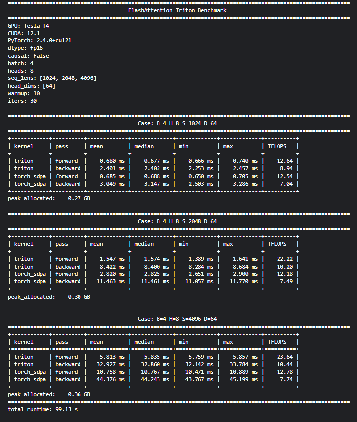
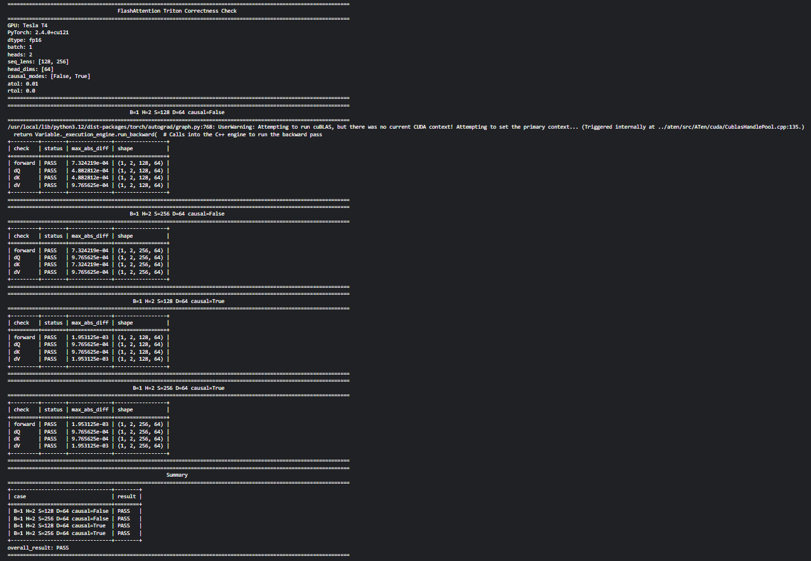

# flash2: A FlashAttention-2 Triton Implementation

A high-performance FlashAttention-style implementation built with Triton and PyTorch. This repository provides optimized forward and backward attention kernels, benchmarking utilities, and numerical correctness validation against PyTorch reference implementations.

## Repository Structure

```text
.
├── README.md
├── .gitignore
├── results/
└── triton/
    ├── benchmark_flash2.py
    ├── check_correctness_flash2.py
    ├── flash2-triton.py
    └── requirements.txt
```

## Features

* Triton-based FlashAttention-style forward and backward kernels
* Custom PyTorch autograd integration
* Numerical correctness validation against PyTorch reference implementations
* Performance benchmarking with CUDA event timing
* Support for causal and non-causal attention
* Configurable batch sizes, sequence lengths, head counts, and head dimensions

## Requirements

Install dependencies using:

```bash
pip install -r triton/requirements.txt
```

### Prerequisites

* Python 3.10+
* NVIDIA GPU with CUDA support
* CUDA Toolkit (compatible with your installed PyTorch version)
* PyTorch
* Triton

Verify CUDA availability:

```bash
nvidia-smi
```

Verify that PyTorch can access the GPU:

```bash
python -c "import torch; print(torch.cuda.is_available())"
```

## Components

### `triton/flash2-triton.py`

Core implementation containing:

* Forward attention kernel
* Backward attention kernels
* Triton kernel launch logic
* `TritonAttention` autograd wrapper

### `triton/benchmark_flash2.py`

Benchmarking utility that:

* Measures latency using CUDA events
* Reports mean, median, minimum, and maximum execution times
* Estimates throughput in TFLOPS
* Compares against PyTorch Scaled Dot Product Attention (SDPA) when available
* Falls back to Triton-only benchmarking when SDPA is unavailable

### `triton/check_correctness_flash2.py`

Validation script that compares Triton outputs against PyTorch reference implementations for:

* Forward pass outputs
* Query gradients (`dQ`)
* Key gradients (`dK`)
* Value gradients (`dV`)

Default settings are intentionally conservative to accommodate memory-constrained GPUs.

## Running Benchmarks

Basic benchmark:

```bash
python triton/benchmark_flash2.py
```

Causal attention benchmark:

```bash
python triton/benchmark_flash2.py --causal --seq-lens 1024,2048 --head-dims 64
```

Larger-scale benchmark:

```bash
python triton/benchmark_flash2.py --batch 8 --heads 16 --seq-lens 4096 --head-dims 64
```

## Running Correctness Validation

Default validation:

```bash
python triton/check_correctness_flash2.py
```

Minimal validation configuration:

```bash
python triton/check_correctness_flash2.py --batch 1 --heads 1 --seq-lens 128 --head-dims 64
```

Extended validation sweep:

```bash
python triton/check_correctness_flash2.py --seq-lens 128,256,512 --head-dims 64 --causal-modes false,true
```

## Kaggle Recommendations

For Kaggle or other resource-constrained environments:

* Begin with sequence lengths of `128` or `256`
* Run correctness checks before large-scale benchmarks
* Avoid dense PyTorch reference attention for very large sequence lengths
* Benchmark Triton kernels independently when GPU memory is limited
* Expect minor autotuning differences across GPU architectures

Recommended workflow:

1. Install dependencies
2. Run correctness validation on small problem sizes
3. Benchmark on target sequence lengths and head dimensions
## Results

### Benchmark Results



### Correctness Validation



## Future Work

Planned improvements include:

* Native CUDA implementation alongside the Triton implementation
* Additional kernel optimizations and autotuning strategies
* Support for a wider range of attention configurations
* Extended benchmarking across different GPU architectures
* Comprehensive performance comparisons between CUDA, Triton, and PyTorch SDPA
* Improved testing and validation coverage
* Multi-GPU experimentation and scaling studies

## References

The implementation and understanding of FlashAttention concepts were informed by the following resources:

1. Tri Dao et al., *FlashAttention: Fast and Memory-Efficient Exact Attention with IO-Awareness*
2. Tri Dao et al., *FlashAttention-2: Faster Attention with Better Parallelism and Work Partitioning*
3. Umar Jamil's educational content and implementation walkthroughs on Attention, FlashAttention, and Triton programming
4. Official Triton Documentation
5. Official PyTorch Documentation

## Acknowledgements

Special thanks to Tri Dao and the FlashAttention research team for their pioneering work on efficient attention algorithms, and to Umar Jamil for providing accessible educational resources that helped deepen understanding of FlashAttention and Triton kernel development.

## Disclaimer

This repository is an independent educational and research implementation. It is not affiliated with or endorsed by the FlashAttention authors, Triton developers, or any associated organizations.

